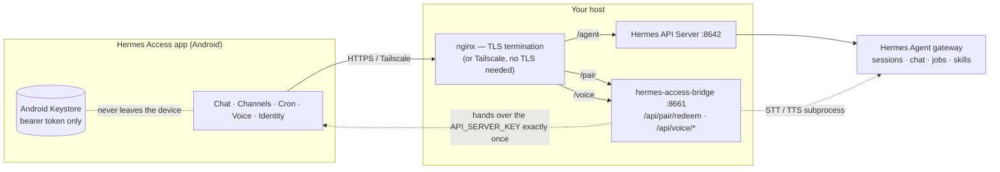
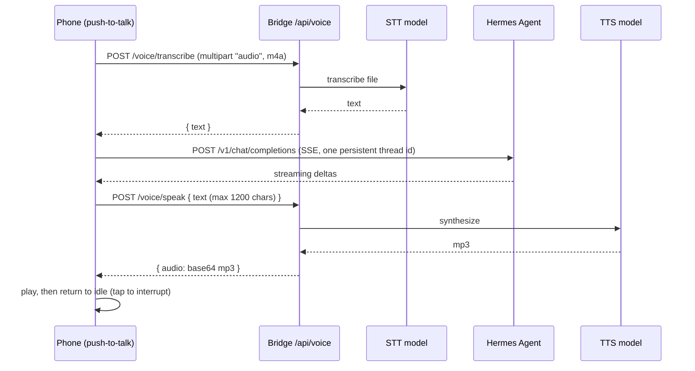
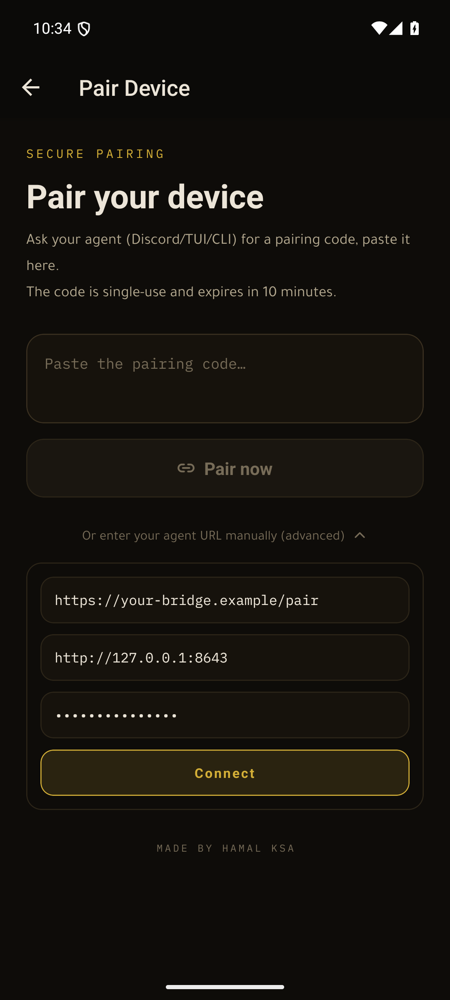
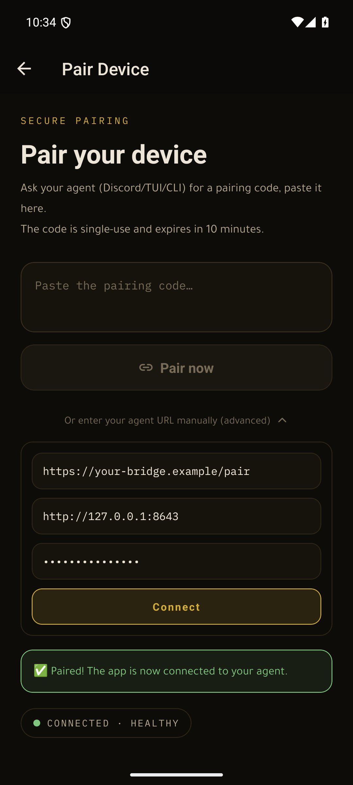
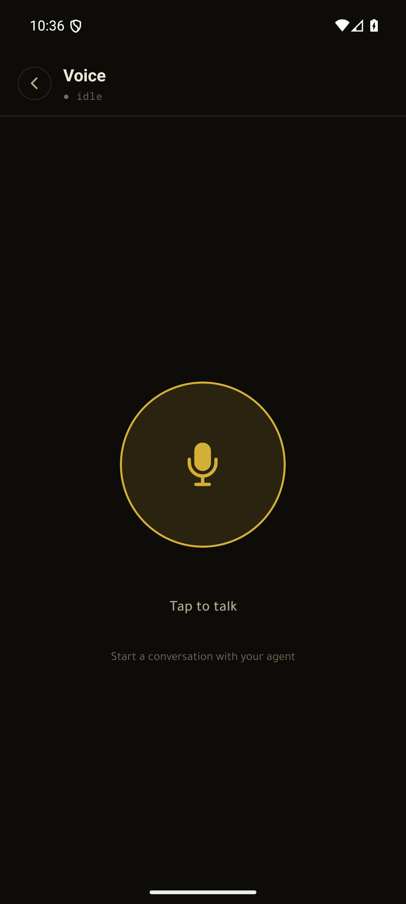
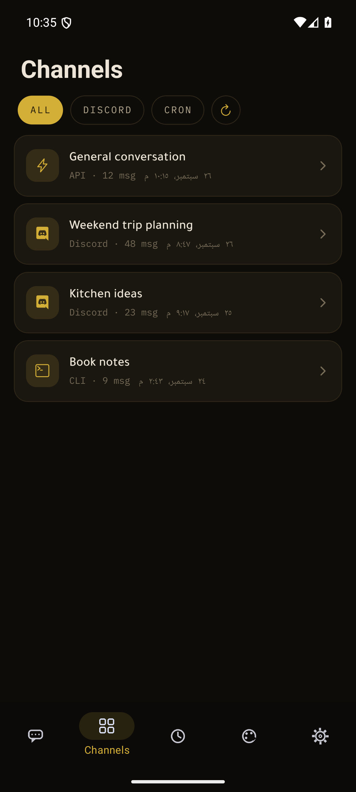
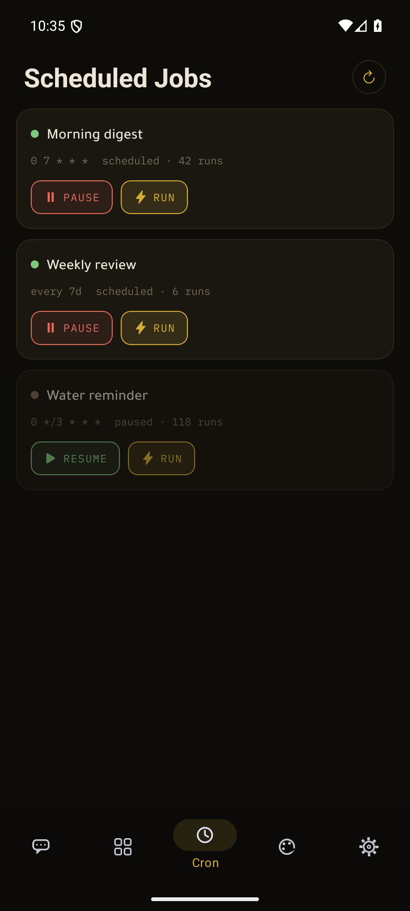
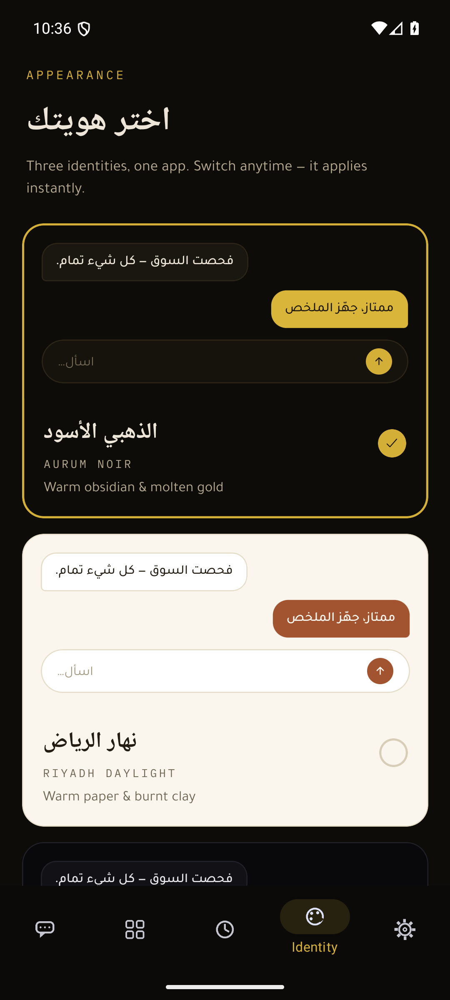
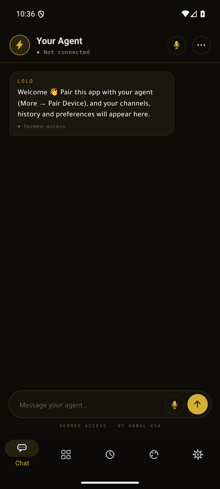

# Hermes Access

**A self-hosted mobile client for [Hermes Agent](https://github.com/NousResearch/hermes-agent) — streaming chat, push-to-talk voice, every channel, and cron control, in your pocket.**

[](LICENSE.md)
[](#quick-start)
[](https://docs.expo.dev/versions/v57.0.0/)
[](app/tsconfig.json)
[](docs/CONTRIBUTING.md)
[](.github/workflows/ci.yml)


**بوّابتك المحمولة إلى وكيل Hermes — شات متدفق، محادثة صوتية بنقرة واحدة، كل القنوات، وتحكّم كامل في المهام المجدولة. لا سيرفرات وسيطة، لا تتبّع، وبياناتك تبقى على بنيتك التحتية أنت.**

> صُنع بواسطة **HAMAL KSA** · مجاني للاستخدام الشخصي · ترخيص PolyForm Noncommercial 1.0.0

*Hermes Agent is a product of Nous Research. Hermes Access is an independent, unaffiliated client.*

---

## What it is

Hermes Access is a native Android client (Expo SDK 57 / React Native 0.86 / TypeScript, strict) that talks **directly** to the API Server of your own [Hermes Agent](https://github.com/NousResearch/hermes-agent) gateway. No vendor account, no hosted middleman, no telemetry: the app ships with **no preconfigured agent address at all** — you pair it with *your* gateway using a one-time code, and the app then speaks to your gateway over your own network (Tailscale or HTTPS).

It exists because a phone is the right form factor for a self-hosted agent, and because some of us would rather not route our agent through Discord or Telegram to reach it from a pocket.

## Features

| Area | What it does | Status |
|---|---|---|
| **Chat** | Streaming replies against the Hermes API Server over SSE, with a stop-mid-run button | ✅ shipped |
| **Channels** | Every Hermes session regardless of source (`discord`, `cron`, `cli`, `api_server`…), with full message history and source filters | ✅ shipped |
| **Continue in thread** | Reply into an existing Hermes session so the conversation stays the same thread your other surfaces see | ✅ shipped |
| **Cron** | Live job list with pause, resume, and run-now | ✅ shipped |
| **Voice** | Push-to-talk loop: record → transcribe → agent → spoken reply → playback, and tap-anytime interruption | ✅ shipped |
| **Pairing** | One-time pairing codes (256-bit, 10-minute TTL, single use), plus a manual URL + token path for advanced users | ✅ shipped |
| **Identity** | Three handcrafted design directions, switched live and persisted across restarts | ✅ shipped |
| **Bilingual** | English primary and Arabic, switchable inside the app | ✅ shipped |
| **Security defaults** | Bearer token only in the Android Keystore; cleartext-target guard; retry/backoff client that fails closed | ✅ shipped |
| **File transfer** | Any-size resumable upload/download | 🚧 roadmap |
| **Push notifications** | Task-completion pings | 🚧 roadmap |
| **iOS** | EAS builds and TestFlight | 🚧 roadmap |

### Three identities, one app

The whole interface is re-skinned live from a single token set — same screens, three complete design directions:

| Identity | Direction |
|---|---|
| **Aurum Noir** | Warm obsidian and molten gold |
| **Riyadh Daylight** | Warm paper and burnt clay, Arabic editorial |
| **Night Courier** | Obsidian ops-deck, mono type, neon-gold signals |

Your choice persists across restarts. See `app/src/theme/tokens.ts`.

## Architecture



The app never talks to a service it did not receive from you. The two surfaces it consumes:

* **The Hermes API Server** (`:8642`) — sessions, message history, cron jobs, and the SSE chat streams. Paths are appended to your connection's base URL.
* **The pairing bridge** (`bridge/server.py`, FastAPI, `:8661`) — one-time code redemption plus the voice relay. In the reference deployment nginx terminates TLS and prefixes these surfaces (`/pair` → bridge, `/agent` → API Server, the app's `/voice/*` calls → the bridge's `/api/voice/*`).

### The voice loop



Every voice turn is transcribed verbatim and answered by *your* agent in *your* agent's language — nothing is translated client-side.

## Quick start

### 1. Enable the Hermes API Server

On the machine running your Hermes gateway (`~/.hermes/.env`):

```bash
API_SERVER_ENABLED=true
API_SERVER_KEY=<a strong random key>
API_SERVER_HOST=<your reachable interface>   # e.g. your Tailscale address
API_SERVER_PORT=8642
```

Then restart the gateway. Verify:

```bash
curl -H "Authorization: Bearer $API_SERVER_KEY" http://<host>:8642/health
```

**Recommended:** reach the gateway over [Tailscale](https://tailscale.com) — WireGuard-encrypted, no ports opened to the internet, and the app accepts Tailscale addresses without TLS. Exposing it publicly works too, but then you must terminate TLS yourself and the app will refuse to send your key to a bare `http://` host.

### 2. Run the pairing bridge

Requires Python 3 with FastAPI + uvicorn. The bridge reads the gateway key from `~/.hermes/.env` — it never stores or logs it.

```bash
cp .env.example .env          # then edit
export BRIDGE_GATEWAY_URL=https://your-agent-host/agent
export BRIDGE_LABEL=my-gateway
export BRIDGE_HOST=127.0.0.1   # bind where you like — tailnet address for phone-first pairing
python bridge/server.py gen   # prints a one-time pairing code
python bridge/server.py       # or run the service (uvicorn, port 8661)
```

Optional: `skill/hermes-access-pairing/SKILL.md` teaches your agent the whole flow, so you can just ask it — *"pair my phone"* — and it will issue a code for you.

### 3. Pair the app

Build from source, or install a release APK from GitHub Releases.

```bash
cd app
npm ci
npx expo run:android          # or: npx expo prebuild --platform android --no-install && cd android && ./gradlew assembleDebug
```

Then in the app: **More → Pair Device** → paste the code → connect. The pairing screen also holds a *Bridge URL* field and a manual *base URL + API token* path, so you can point the app at your own bridge without rebuilding.

**Pointing the app at your bridge.** The pairing screen's *Bridge URL* field is editable on every install, so you can pair without rebuilding. To make your own bridge the compiled-in default for a fork, set `EXPO_PUBLIC_DEFAULT_BRIDGE` in `app/.env` (Expo inlines `EXPO_PUBLIC_*` variables at build time) — `DEFAULT_BRIDGE` in `app/src/app/setup.tsx` reads exactly that variable and is **empty by default**, so a fresh build never ships pointing at somebody else's server.

Inspect the installed keystore-backed token state any time: connection status and the gateway label appear in **More**.

## Security model

Security was the first design constraint, not a later hardening pass.

* **The bearer token never touches anything but the Android Keystore.** It is read and written exclusively through `expo-secure-store` (`app/src/gateway/store.ts`). It is never written to `AsyncStorage`, never logged, and never committed. Only non-secret metadata (base URL, label) is persisted in the regular store.
* **Cleartext is refused to unknown hosts.** `isSafeBaseUrl()` accepts `https://`, loopback, and Tailscale's CGNAT range (`100.64.0.0/10`) — everything else is rejected before the key is stored, on pairing, on manual connect, and on every restart.
* **Pairing codes are single use and short lived.** 256-bit random, 10-minute TTL, marked used *before* anything is handed over, redemption rate-limited (5/min/IP) and fail-closed on any error.
* **The bridge hands over the gateway key exactly once, already inside an encrypted channel.** There is no durable pairing secret sitting on the phone.
* **Revocation is a key rotation.** The bridge hands the same `API_SERVER_KEY` to every paired device, so removing a device means rotating that key on the gateway. See [SECURITY.md](SECURITY.md) — this is documented as a known, accepted property, not a vulnerability.

Full policy, threat model, and disclosure channel: [SECURITY.md](SECURITY.md).

## Screenshots

Real captures from v0.4.4 running on an Android emulator — all data shown is generated by a local demo server; no real business data ships in this repo.

| Pair by one-time code | Connected & healthy | Voice conversation |
|---|---|---|
|  |  |  |

| Channels inbox | Cron control | Identity (3 themes) | Chat (Aurum Noir) |
|---|---|---|---|
|  |  |  |  |

## Repository layout

```
app/        Hermes Access mobile app (Expo / React Native / TypeScript)
bridge/     hermes-access-bridge — pairing redemption + voice relay (FastAPI)
skill/      hermes-access-pairing SKILL.md — teaches your agent the pairing flow
scripts/    signing, keystore, and gateway/environment helper scripts
docs/       PLAN.md, PRD.md, ARCHITECTURE.md, CONTRIBUTING.md, design artifacts
```

API surfaces with exact request/response shapes: [docs/ARCHITECTURE.md](docs/ARCHITECTURE.md).

## Roadmap

* **iOS** — EAS builds, Apple Developer enrollment, TestFlight
* **File transfer** — any-size chunked, resumable upload and download
* **Push notifications** — task-completion alerts via ntfy
* **More voice** — additional STT/TTS voices and languages

Roadmap items are not shipped features. Anything marked ✅ in the feature table above is wired into the app in this repo.

## Contributing

PRs are welcome. Start with [docs/CONTRIBUTING.md](docs/CONTRIBUTING.md) for the dev setup, the `tsc --noEmit` gate, the signing/prebuild landmines, and the on-device boot-test requirement for native-module changes. Security reports go through the private channel in [SECURITY.md](SECURITY.md), never a public issue.

## License

**PolyForm Noncommercial License 1.0.0** — free for personal, non-commercial use: personal projects, study, hobby work, research, and use by noncommercial organisations. **Commercial use is not permitted** and requires a written license from HAMAL KSA. Plainly: you can use it, read it, modify it, and share it for non-commercial purposes — you cannot sell it, bundle it into a paid product, or use it commercially. See [LICENSE.md](LICENSE.md).

Dependencies remain under their own licenses. Hermes Agent itself is Nous Research's open-source project.

## Acknowledgements

* [**Hermes Agent**](https://github.com/NousResearch/hermes-agent) by [Nous Research](https://nousresearch.com) — the agent this client speaks to
* [**Expo**](https://expo.dev) and React Native — the app platform
* **DashScope Qwen** — the STT/TTS models behind the voice relay
* The PolyForm Project for the license text

---

> **صُنع بواسطة / Made by HAMAL KSA** — م. طارق منفل النور بخيت · 0568143175 · tarekmonufal@gmail.com